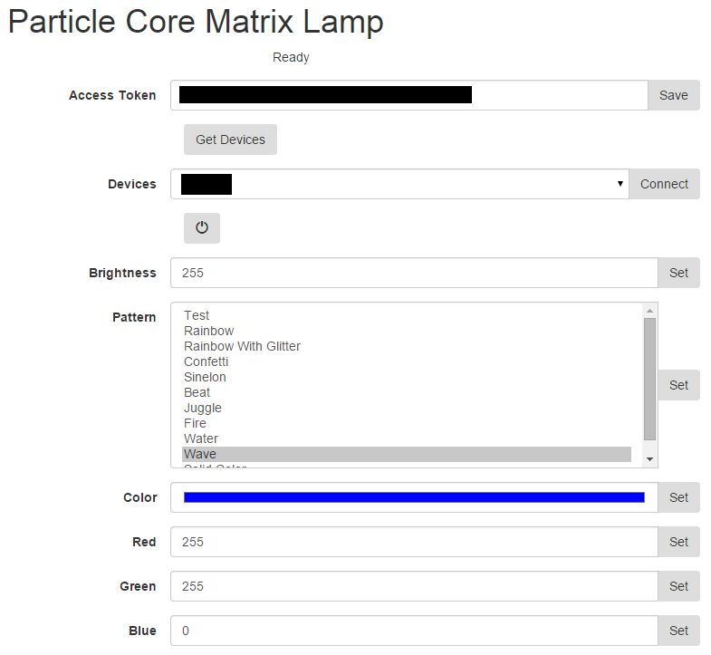

Particle Core Matrix Lamp
=========

Control a small matrix of APA102C RGB LEDs with a [Spark Core] via a web browser or smartphone app.

[Demo Video](https://www.youtube.com/watch?v=s3mbcSl60YI):

[Build Details](https://plus.google.com/u/0/photos/+JasonCoon1/albums/6162246797168578737):

Hardware
--------
Requires:

* [Particle Core](https://store.particle.io/assets/core-a6fcc2b47e235d529ab58fe0a1124588.png)
* RGB LED strip.  I used this strip of [APA102C RGB LEDs 144 per meter](http://www.aliexpress.com/item/1-meter-144pcs-APA-102C-addressable-led-pixel-strip-144pixels-m-non-waterproof-WHITE-PCB/32268465139.html), but you could easily use NeoPixels or other LED strips.  Adafruit sells APA102s as [DotStars](https://learn.adafruit.com/adafruit-dotstar-leds/overview).
* Small 5V USB power supply, at least 2A.
* USB cable
* Twist or zip ties
* [3" Female/Female Jumper Wires](https://www.adafruit.com/products/1951)
* [Break-away 0.1" 36-pin strip male header](https://www.adafruit.com/products/392)
* 1.5" PVC pipe

Optional:

[IKEA LAMPAN Lamp], or some other way of mounting the LEDs.

Features
--------
* Turn the lamp on and off
* Adjust the brightness
* Change the display pattern
* Display a solid color

Patterns are requested by the app from the Core, so as new patterns are added, they're automatically listed in the app.

[Particle Core]:https://store.particle.io/?product=spark-core
[IKEA LAMPAN Lamp]:http://www.ikea.com/us/en/catalog/products/20055421/
